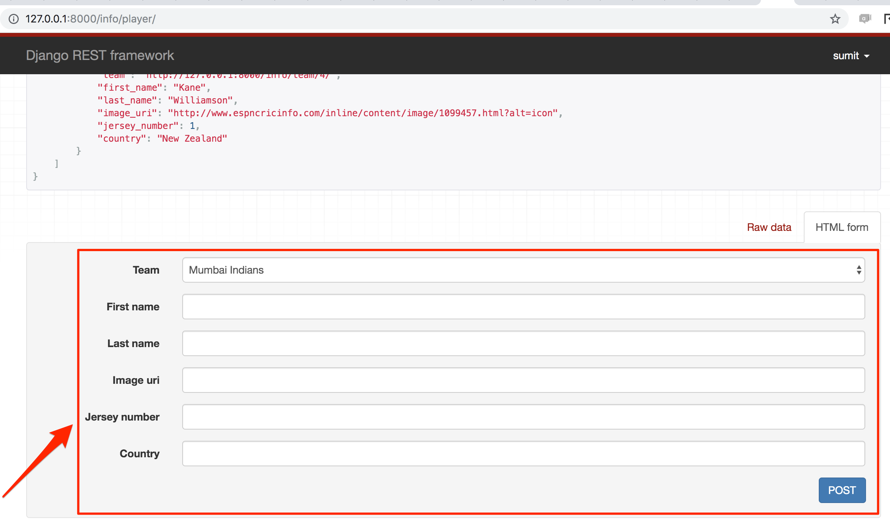

# uts

## cricket app based on Django

# How to setup the application?

`virtualenv -p python venv`

`source venv/bin/activate`

`pip install -r requirements.txt`

# How to run the application?

`python manage.py runserver`

# How to run the tests?

`python manage.py test`


Gives the list of browsable REST APIs.

`{{host}}/info/`

Gives the list of teams

`{{host}}/info/team/?format=json`

Returns the REST API response in JSON format as shown below

```json
  "count": 4,
  "next": null,
  "previous": null,
  "results": [
    {
      "id": 4,
      "name": "Sunrisers Hyderabad",
      "logo_uri": "https://a1.espncdn.com/combiner/i?img=/i/teamlogos/cricket/500/628333.png",
      "club_state": "Hyderabad"
    },
    {
      "id": 3,
      "name": "Delhi Capitals",
      "logo_uri": "https://a1.espncdn.com/combiner/i?img=/i/teamlogos/cricket/500/335975.png",
      "club_state": "Delhi"
    },
    {
      "id": 2,
      "name": "Chennai Super Kings",
      "logo_uri": "https://a1.espncdn.com/combiner/i?img=/i/teamlogos/cricket/500/335974.png",
      "club_state": "Tamilnadu"
    },
    {
      "id": 1,
      "name": "Mumbai Indians",
      "logo_uri": "https://a1.espncdn.com/combiner/i?img=/i/teamlogos/cricket/500/335978.png",
      "club_state": "Maharastra"
    }
  ]
}
```


A new team can be created using the form as shown in the below picture:





`Host: {{host}}/info/player/`
`Method: GET`


Returns the list of all players


`/info/player-stats/`

`Method: GET`


Returns the list of all player's stats


`/info/matches/`

`Method: GET`


Returns the list of all matches played


`/team`

`Method: GET`


Returns the list of all teams with clickable user interface


`{{host}}/team/1`

`Method: GET`


Returns the list of all players from team_id 1


`{{host}}/team/1/player/1`

`Method: GET`


Returns the stats belonging to the player_id 1 from team_id 1


CRUD REST APIs for team, player, player stats and matches

## Team Entity

Create Team:

`curl -X POST {{host}}/info/team/ -d '{"name": "Mumbai Indians", "logo_uri": "https://domain.com/mi.png", "club_state": "Maharashtra"}' -H 'Content-Type: application/json'`


Get Team:

`curl -X GET {{host}}/info/team/1/?format=json`


Update Team:

`curl -X PATCH {{host}}/info/team/1/ -d '{"name": "MI"}' -H 'Content-Type: application/json'`


Delete Team:

`curl -X DELETE {{host}}/info/team/1/`


## Player Entity

Create Player:

`curl -X POST {{host}}/info/player/ -d '{"team": "{{host}}/info/team/1/", "first_name": "Rohit", "image_uri": "https://domain.com/rs.png", "last_name": "Sharma", "country": "India"}' -H 'Content-Type: application/json'`


Get Player:

`curl -X GET {{host}}/info/player/1/?format=json`


Update Player:

`curl -X PATCH {{host}}/info/player/1/ -d '{"jersey_numer": "10"}' -H 'Content-Type: application/json'`


Delete Player:

`curl -X DELETE {{host}}/info/player/7/`


## Player Stats Entity

Create Player Stats:

`curl -X POST {{host}}/info/player-stats/ -d '{`
    `"player": "{{host}}/info/player/1/",`
    `"matches_count": 321,`
    `"runs_count": 8408,`
    `"highest_score": 118,`
    `"fifties_count": 57,`
    `"hundreds_count": 6`
`}' -H 'Content-Type: application/json'`


Get Player Stats:

`curl -X GET {{host}}/info/player-stats/1/?format=json`


Update Player Stats:

`curl -X PATCH {{host}}/info/player-stats/1/ -d '{"highest_score": "119"}' -H 'Content-Type: application/json'`


Delete Player Stats:

`curl -X DELETE {{host}}/info/player-stats/1/`


## Match Entity

Create Match:

`curl -X POST {{host}}/info/matches/ -d '{"team1": "{{host}}/info/team/3/", "team2": "{{host}}/info/team/4/", "winner": "{{host}}/info/team/3/"}' -H 'Content-Type: application/json'`


Get Match:

`curl -X GET {{host}}/info/info/matches/?format=json`


Update Match:

`curl -X PATCH {{host}}/info/matches/174/ -d '{"winner": "{{host}}/info/team/2/"}' -H 'Content-Type: application/json'`


Delete Match:

`curl -X DELETE {{host}}/info/matches/174/`


